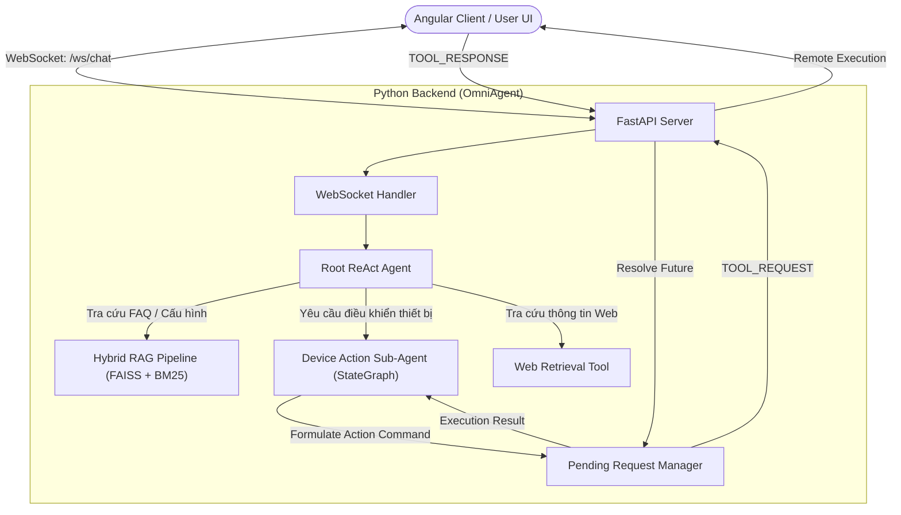

# OmniAgent: Real-Time AI Assistant & Cross-App Automation Framework

<p align="center">
  
  
  
  
  
  
</p>

---

## 📌 Project Overview

**OmniAgent** is an agentic AI assistant backend that integrates **LangGraph** hierarchical workflows, a **hybrid semantic-lexical RAG pipeline** (FAISS + BM25), and **real-time bidirectional WebSockets** to automate hardware device interactions (device detection, connection, configuration parameter writing) directly within an external Angular web application.

---

## ✨ Key Features

- 🤖 **Hierarchical Multi-Agent Architecture**: Uses a two-tier agent structure (Root Agent + Device Control Sub-Agent) built on **LangGraph StateGraph** to manage multi-turn reasoning, route sub-tasks, and handle interactive user clarification loops.
- ⚡ **Real-Time Cross-App Automation**: Enables bidirectional WebSocket communication with an external Angular client. The server issues non-blocking `TOOL_REQUEST` actions, suspends execution asynchronously via a future-based request manager, and resumes when the client returns a `TOOL_RESPONSE`.
- 🔍 **Hybrid Retrieval-Augmented Generation (RAG)**: Combines dense vector embeddings (**FAISS**) with sparse lexical indexing (**BM25**) using Reciprocal Rank Fusion (RRF) to retrieve technical device specifications and configuration parameters accurately.
- 📊 **Automated LLM-as-a-Judge Evaluation**: Includes a built-in RAG evaluation suite that auto-generates synthetic test datasets from raw technical documentation and measures retrieval quality via **Hit Rate@K** and **MRR@K**.

---

## 🏗️ System Architecture



---

## 📁 Repository Structure

```text
OmniAgent/
├── src/
│   ├── main.py                     # CLI and Uvicorn server entrypoint
│   ├── agent/                      # LangGraph ReAct agent & sub-agent nodes
│   │   ├── graph.py                # Root agent graph definition
│   │   ├── nodes/                  # Agent decision nodes and tool callers
│   │   ├── prompts/                # System instructions & prompt templates
│   │   └── tools/                  # Sub-agent, Web Search & Remote tool handlers
│   │       ├── remote_tool.py      # Async WebSocket command dispatcher
│   │       └── sub_agent/          # Device control state machine (action_agent.py)
│   ├── api/                        # FastAPI application & WebSocket handlers
│   │   ├── app.py                  # FastAPI instance & /ws/chat endpoint
│   │   └── websocket/              # Connection manager & request resolvers
│   ├── rag/                        # RAG & evaluation suite
│   │   ├── reading_parameter_pipeline.py  # Hybrid FAISS + BM25 retrieval
│   │   ├── evaluator.py            # LLM-as-a-Judge evaluation framework
│   │   └── retriever.py            # Vector store retriever helpers
│   ├── config/                     # Application settings & LLM initializers
│   └── utils/                      # Loggers & custom exceptions
├── Rag-system/                     # Offline vector database indexing & data merging scripts
├── simple-multimodal-rag/          # ChromaDB multimodal RAG pipeline
├── pyproject.toml                  # Project metadata & dependencies
└── .gitignore                      # Git ignore rules
```

---

## 🚀 Getting Started

### Prerequisites

- **Python 3.10+**
- **pip** or **uv** package manager

### Installation

1. **Clone the repository**:
   ```bash
   git clone git@github.com:anhtudayne/OmniAgent.git
   cd OmniAgent
   ```

2. **Create and activate a virtual environment**:
   ```bash
   python -m venv .venv
   source .venv/bin/activate  # On Windows: .venv\Scripts\activate
   ```

3. **Install dependencies**:
   ```bash
   pip install -r pyproject.toml
   # or if using uv:
   # uv sync
   ```

4. **Configure environment variables**:
   Create a `.env` file in `src/config/.env` (or project root):
   ```env
   LLM_API_KEY=your_gemini_or_groq_api_key_here
   LLM_BASE_URL=https://api.groq.com/openai/v1
   LLM_MODEL=llama-3.3-70b-versatile
   API_HOST=0.0.0.0
   API_PORT=8000
   ```

---

## 💻 Running the Application

### 1. Interactive CLI Mode
Run the ReAct agent directly in your terminal for testing:
```bash
python src/main.py
```

### 2. WebSocket Server Mode
Start the FastAPI server for integration with the Angular frontend:
```bash
python src/main.py --server
```
The server will start at `http://localhost:8000`. WebSocket endpoint is available at `ws://localhost:8000/ws/chat`.

---

## 🔄 WebSocket Communication Protocol

Communication between **OmniAgent** and the Angular client follows a structured JSON messaging pattern over WebSockets:

| Message Type | Direction | Payload Example / Description |
| :--- | :--- | :--- |
| `user_message` | Client ➡️ Server | `{"type": "user_message", "content": "Connect to Magellan 1500i scanner"}` |
| `tool_request` | Server ➡️ Client | `{"type": "tool_request", "request_id": "req-123", "command": {"action": "CONNECT_DEVICE", "parameters": {"deviceName": "Magellan 1500i"}}}` |
| `tool_response` | Client ➡️ Server | `{"type": "tool_response", "request_id": "req-123", "result": {"status": "SUCCESS", "details": "Connected successfully"}}` |

---

## 📈 RAG Evaluation Framework

OmniAgent includes an evaluation suite (`src/rag/evaluator.py`) designed to measure search accuracy and answer quality:
- **Synthetic Test Generation**: Automatically generates ground-truth Q&A pairs from scanner parameter documentation.
- **Retrieval Metrics**: Evaluates **Hit Rate@K** and **Mean Reciprocal Rank (MRR@K)** across BM25, Semantic FAISS, and Hybrid Reciprocal Rank Fusion (RRF).
- **Generation Quality**: Uses **LLM-as-a-Judge** scoring (1–5 scale) to assess hallucination rates and accuracy against official documentation.

---

## 📝 License

Distributed under the **MIT License**. See `LICENSE` for more information.
